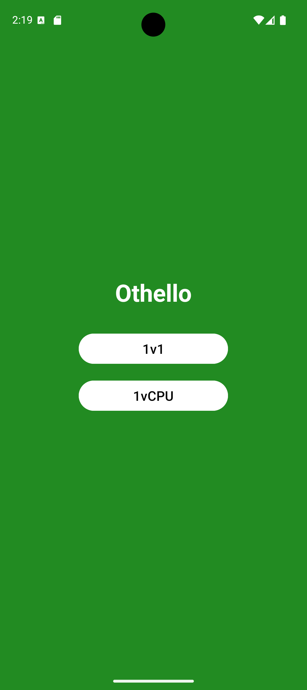
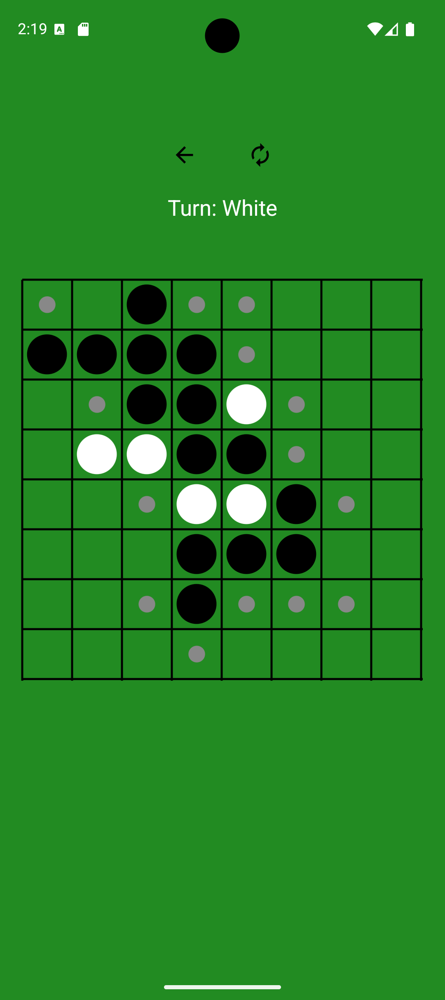

# 🏆 Othello Reversi - Android Game

A simple and lightweight **Othello (Reversi)** game for Android, built using **Java**.  
Play against a friend or challenge an **AI opponent** with a **Greedy Algorithm**!

---

## 📌 Features
👉 **1v1 Mode** – Play locally with a friend.  
👉 **1vCPU Mode** – Battle against a CPU opponent.  
👉 **Smooth Animations** – Pieces flip smoothly when captured.  
👉 **Turn Indicator** – Clearly see whose turn it is.  
👉 **Restart & Back Buttons** – Easily restart or return to the main menu.  
👉 **Optimized UI** – Simple, clean, and user-friendly design.

---

## 📸 Screenshots
### 🎮 Main Menu


### 🏆 Gameplay

---

## 🛠️ How to Build & Run
### **📅 Clone the Repository**
```sh
git clone https://github.com/lucifer-140/Othello.git
cd OthelloReversi
```

### **📦 Open in Android Studio**
1. Open **Android Studio**.
2. Click **File → Open**, then select the **OthelloReversi** folder.
3. Let Gradle sync the project.

### **▶️ Run the App**
1. Connect a **physical device** via USB or launch an **Android Emulator**.
2. Click **Run (▶️)** in Android Studio.

---

## 🎮 How to Play
### **Game Objective**
- The goal is to have **more pieces of your color** on the board by the end of the game.

### **Placing Pieces**
- Players take turns placing pieces on the board.
- Each placed piece must **sandwich opponent pieces** to flip them.

### **Winning Conditions**
- The game ends when **no more moves are possible**.
- The player with **more pieces on the board wins**.

---

## 🤖 AI Implementation
The **CPU opponent** uses a **Greedy Algorithm**, which means it:
- Always picks the **move that flips the most pieces** immediately.
- Does **not** predict future moves (not as strong as Minimax AI).

Future improvements may include:
- **Minimax Algorithm** for a smarter AI.
- **Alpha-Beta Pruning** to optimize AI performance.

---

## 💡 Planned Features & Improvements
🚀 Improve AI difficulty (Minimax / Alpha-Beta Pruning).  
🎨 Enhance UI with better graphics, sound, and animations.  
🌍 Add **Online Multiplayer** support using Firebase.  
📊 Show **score indicators** on the board.

---

## 🔧 Tech Stack
- **Language**: Java
- **Framework**: Android SDK
- **IDE**: Android Studio
- **Version Control**: Git & GitHub

---

## 🛠️ Troubleshooting
If you run into issues:
- Make sure **Android Studio** and **Gradle** are up-to-date.
- Try **`File → Invalidate Caches & Restart`** in Android Studio.
- Check if **`build.gradle`** dependencies are properly synced.

---
🚀 Enjoy playing Othello Reversi! 🏆